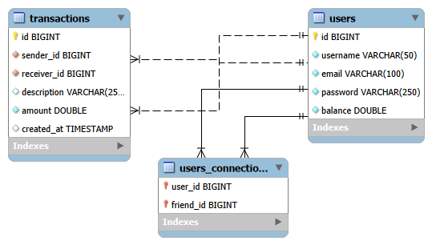

# Pay My Buddy

## Description

Pay My Buddy est un prototype d'application web permettant aux utilisateurs d'effectuer des transferts d'argent entre relations de manière simple, rapide et sécurisée.

Ce projet a été réalisé dans le cadre de la formation **Développeur d'Applications Java** d'OpenClassrooms.


## Fonctionnalités

* Création d'un compte utilisateur
* Authentification sécurisée
* Gestion du profil utilisateur
* Ajout de relations
* Réalisation de transferts d'argent
* Consultation de l'historique des transactions
* Gestion des erreurs utilisateur
* Journalisation des événements (logs)


## Technologies utilisées

### Back-end

* Java 17
* Spring Boot
* Spring Security
* Spring Data JPA
* Hibernate

### Front-end

* Thymeleaf
* HTML5
* CSS3

### Base de données

* MySQL

### Tests

* JUnit 5
* Mockito
* JaCoCo
* Maven Surefire


## Architecture du projet

Le projet est organisé selon une architecture en couches :

* Controller : gestion des requêtes HTTP
* Service : logique métier
* Repository : couche DAL (Data Access Layer)
* Model : entités JPA
* Base de données MySQL


## Modèle Physique de Données (MPD)



Le modèle physique de données est composé des tables suivantes :

### users

| Colonne  | Type    |
| -------- | ------- |
| id       | BIGINT  |
| username | VARCHAR |
| email    | VARCHAR |
| password | VARCHAR |
| balance  | DOUBLE  |

### users_connections

| Colonne   | Type   |
| --------- | ------ |
| user_id   | BIGINT |
| friend_id | BIGINT |

### transactions

| Colonne     | Type    |
| ----------- | ------- |
| id          | BIGINT  |
| sender_id   | BIGINT  |
| receiver_id | BIGINT  |
| description | VARCHAR |
| amount      | DOUBLE  |

### Relations

* Un utilisateur peut posséder plusieurs relations.
* Une relation relie deux utilisateurs.
* Un utilisateur peut envoyer plusieurs transactions.
* Un utilisateur peut recevoir plusieurs transactions.

---

## Scripts SQL

Les scripts SQL sont disponibles dans le dossier `docs` :

- `docs/schema.sql`
- `docs/data.sql`

### Création de la base de données

```sql
CREATE DATABASE mydb;
```

Exécuter ensuite :

1. schema.sql
2. data.sql


## Configuration de la base de données

Pour des raisons de sécurité, le mot de passe de la base de données n'est pas stocké dans le code source.

Créer une variable d'environnement :

### Windows

```cmd
setx DB_PASSWORD "votre_mot_de_passe"
```

Configuration Spring Boot :

```properties
spring.datasource.password=${DB_PASSWORD}
```


## Gestion des transactions

La gestion des transactions est réalisée avec Spring grâce à l'annotation :

```java
@Transactional
```

Cette approche permet :

* le commit automatique en cas de succès ;
* le rollback automatique en cas d'erreur ;
* la cohérence des données.


## Sécurité

Le projet implémente :

* Spring Security
* Authentification par formulaire
* Chiffrement des mots de passe avec BCrypt
* Protection des pages privées
* Utilisation de variables d'environnement pour les données sensibles

---

## Accessibilité (WCAG)

Le prototype respecte plusieurs recommandations WCAG :

* Utilisation des balises label
* Utilisation d'attributs aria-label
* Navigation clavier native
* Messages d'erreur et de succès visibles
* Langue du document définie en français
* Structure HTML sémantique


## Tests

Des tests unitaires ont été réalisés avec :

* JUnit 5
* Mockito

### Classes testées

* TransactionService
* UserService
* UserConnectionService
* CustomUserDetailsService
* TransferController
* ProfileController
* ConnectionController
* SecurityConfig

### Couverture de code

* JaCoCo : environ 80 %

### Génération des rapports

```bash
mvn clean verify
mvn site
```

Rapports disponibles dans :

```text
target/site/index.html
```


## Journalisation (Logs)

L'application utilise SLF4J avec Spring Boot.

Les événements importants sont enregistrés :

* ouverture des pages
* demandes de transfert
* transferts réussis
* erreurs de transfert

Les logs sont enregistrés dans :

```text
logs/paymybuddy.log
```


## Lancement du projet

### Compilation

```bash
mvn clean install
```

### Exécution

```bash
mvn spring-boot:run
```

L'application sera disponible à l'adresse :

```text
http://localhost:8080
```


## Auteur

Rebecca Guimaraes

Projet réalisé dans le cadre de la formation Développeur d'Applications Java OpenClassrooms.
